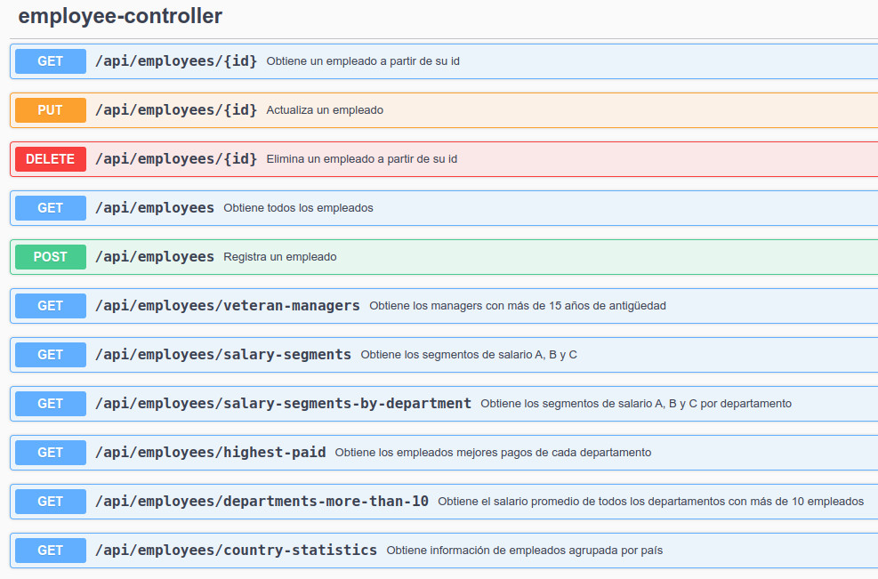

# Desafío Técnico - Empleados

[](#) [](#) [](#) [](#) [](#)

## Diagrama de Base de Datos 📘

A partir del siguiente diagrama de base de datos se solicita la construcción de 6 consultas específicas.

<div style="text-align: center;">
  
</div>

Las consultas se encuentran en el archivo **queries.sql** dentro de este repositorio. Del mismo modo, las enumero a continuación:

1. Obtener cantidad de empleados dentro de los siguientes segmentos de sueldo:
   SEGMENTO A: menor a USD 3.500
   SEGMENTO B: mayor o igual a USD 3.500 y menor que USD 8.000
   SEGMENTO C: mayor o igual a USD 8.000.

```sql
SELECT
    CASE
        WHEN salary < 3500 THEN 'SEGMENTO A'
        WHEN salary >= 3500 AND salary < 8000 THEN 'SEGMENTO B'
        WHEN salary >= 8000 THEN 'SEGMENTO C'
    END AS SalarySegment,
    COUNT(*) AS EmployeeCount
FROM employees
GROUP BY SalarySegment
ORDER BY SalarySegment;
```

2. Utilizando la tabla “departments” se requiere realizar la misma agrupación
   de segmentos de sueldo, pero por departamento.

```sql
SELECT
    d.department_name as DeparmentName,
    CASE
        WHEN e.salary < 3500 THEN 'SEGMENTO A'
        WHEN e.salary >= 3500 AND e.salary < 8000 THEN 'SEGMENTO B'
        WHEN e.salary >= 8000 THEN 'SEGMENTO C'
    END AS SalarySegment,
    COUNT(*) AS EmployeeCount
FROM employees e
INNER JOIN departments d ON e.department_id = d.department_id
GROUP BY d.department_name, SalarySegment
ORDER BY d.department_name, SalarySegment;
```

3. Información del empleado con mayor sueldo de cada departamento.

```sql
SELECT
    d.department_name as DepartmentName,
    d.DEPARTMENT_ID as DepartmentId,
    e.EMPLOYEE_ID as EmployeeId,
    e.first_name as FirstName,
    e.last_name as LastName,
    e.EMAIL as Email,
    e.PHONE_NUMBER as PhoneNumber,
    e.salary as Salary
FROM employees e
INNER JOIN departments d ON e.department_id = d.department_id
WHERE (e.department_id, e.salary) IN (
	SELECT department_id, MAX(salary)
	FROM employees
	GROUP BY department_id
)
ORDER BY d.department_name;
```

4. Información de los gerentes que hayan sido contratados hace más de 15 años.

```sql
SELECT
    e.employee_id,
    e.first_name,
    e.last_name,
    e.hire_date,
    d.department_name,
    j.job_title
FROM employees e
INNER JOIN departments d ON e.employee_id = d.manager_id
INNER JOIN jobs j ON e.job_id = j.job_id
WHERE YEAR(e.hire_date) < YEAR(NOW()) - 15
ORDER BY e.hire_date;
```

5. Salario promedio de todos los departamentos que tengan más de 10 empleados.

```sql
SELECT
	d.department_id AS DepartmentId,
    d.department_name AS DeparmentName,
    ROUND(AVG(e.salary), 2) AS AverageSalary,
    COUNT(e.employee_id) AS EmployeeCount
FROM departments d
INNER JOIN employees e ON d.department_id = e.department_id
GROUP BY d.department_id, d.department_name
HAVING COUNT(e.employee_id) > 10
ORDER BY AverageSalary DESC;
```

6. Obtener la siguiente información agrupada por país: cantidad empleados,
   salario promedio, salario más alto, salario más bajo, promedio años
   antigüedad.

```sql
SELECT
    c.country_name AS CountryName,
    COUNT(e.employee_id) AS EmployeeCount,
    ROUND(AVG(e.salary), 2) AS AverageSalary,
    MAX(e.salary) AS HighestSalary,
    MIN(e.salary) AS LowestSalary,
    ROUND(AVG(TIMESTAMPDIFF(YEAR, e.HIRE_DATE, CURRENT_DATE)), 2) AS AverageYearsOfService
FROM employees e
INNER JOIN departments d ON e.department_id = d.department_id
INNER JOIN locations l ON d.location_id = l.location_id
INNER JOIN countries c ON l.country_id = c.country_id
LEFT JOIN job_history jh ON e.employee_id = jh.employee_id
WHERE jh.employee_id IS NULL -- Elimina empleados que ya no están en la empresa
GROUP BY c.country_name
ORDER BY EmployeeCount DESC;
```

## Mis consideraciones 📝

Por motivos de tiempo, en este proyecto se construye una api mínima con todas las entidades de la base de datos, el crud sólo para empleados y los endpoints necesarios para ejecutar las consultas presentadas previamente.

El objetivo es demostrar la ejecución de consultas SQL nativas desde el backend, mapeando la información recibida a dtos específicos, y demostrar como van cambiando los resultados obtenidos al modificar la información de los empleados.

En este proyecto se utiliza la librería **Lombok** para reducir el boilerplate.

**<u>IMPORTANTE</u>: En el repositorio del desafío de [Vehículos](https://github.com/PabloMusaber/vehicles-control) se puede apreciar una API completa, con CRUD para sus entidades, manejo de excepciones, herramienta de logging, deploy en Azure con Docker y demás características.**

## Tecnologías y herramientas utilizadas 🔧

- Java 21
- Spring Boot 3.4.4
- Maven 3.6.3
- MySQL 8.0.41
- Ubuntu 22.04
- Visual Studio Code
- Postman

## Descripción de funcionalidades ⚙️

La funcionalidad principal de esta API es realizar las consultas solicitadas para la base de datos de empleados.

Para comprobar el funcionamiento correcto de estas consultas se agrega también el CRUD de empleados, a fin de ver cómo van mutando los resultados obtenidos al realizar cambios en la base.

Los endpoints disponibles para realizar estas acciones son los siguientes:

<div style="text-align: center;">
  
</div>

## Uso del proyecto 📝

Es requisito para ejecutar este proyecto contar con Java, Maven y MySQL instalados. Luego, seguir estos pasos:

1. Clonar el repositorio:

```
git clone https://github.com/PabloMusaber/employees-control.git
```

2. Importar el dump de la base de datos que se encuentra en el archivo **database_dump.sql** en este repositorio. Para eso se puede usar el comando:

```
mysql -u [usuario_sql] -p employees < database_dump.sql
```

3. Ejecutar el proyecto y probar los endpoints. Se puede probar utilizando **Swagger** desde http://localhost:8080/swagger-ui/index.html

_NOTA_: Hay un dato incorrecto en la base dump que genera un warning al levantar el sistema. Puede borrarse ejecutando esta consulta en la base:

```
DELETE FROM job_history WHERE employee_id = 0
```
